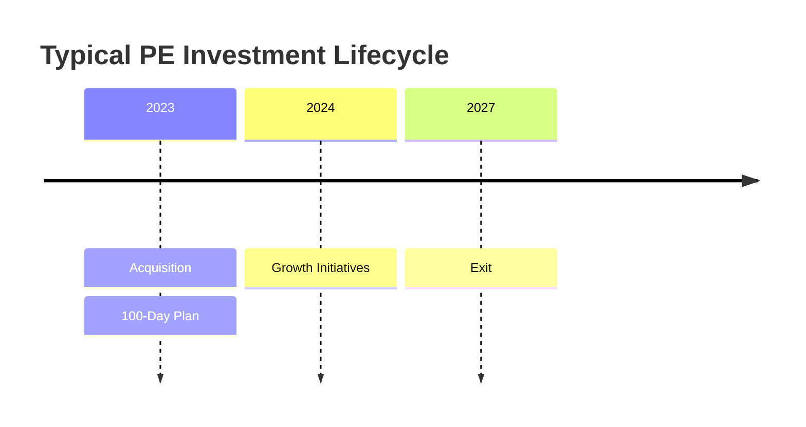
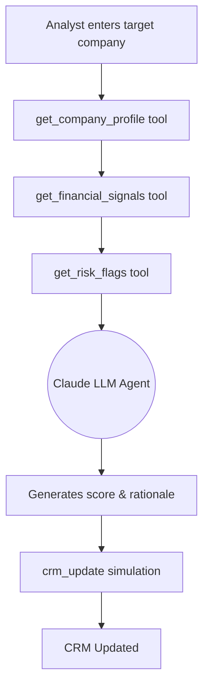

# Summit Equity Partners

**Executive Summary:** Summit Equity Partners is a mid-market buyout fund specializing in high-growth, technology-enabled businesses. The fund targets B2B SaaS, healthcare IT, and FinTech companies with $5-50M revenue and healthy EBITDA. Preferred companies have recurring revenue models and robust margins. This document presents a sample investment thesis: it sets the fund’s sector and size criteria and outlines evaluation steps (market sizing, competitive analysis, value creation, and exit strategy).

## Investment Thesis
- **Target sectors:** Technology-enabled business services, especially **B2B SaaS**, **Healthcare IT**, and **FinTech (digital payments)**. 
- **Company size:** Lower middle-market with **$5-50M annual revenue** (~$3-15M EBITDA), typically profitable or near break-even. 
- **Geography:** North America (US & Canada), with optional Western Europe. 
- **Ownership/stage:** Majority or carve-out buyouts of founder/family businesses or corporate divisions (avoid pre-revenue startups). 
- **Growth & margins:** Companies growing **15–30%+ annually** with **EBITDA margins 15–30%**. Prefer recurring-revenue models (subscriptions, SaaS). 
- **Business model:** High-retention subscription or contract-based services (e.g. SaaS, managed services, fintech platforms). 
- **Other filters:** Strong management team, scalable operations, and exposure to secular trends (e.g. digital adoption). 

## Market Sizing (TAM/SAM/SOM Checklist)
Ensure the target market is large enough: 
- **TAM (Total Addressable Market):** Ideally **>$1B** in global or regional revenue【16†L189-L198】. TAM is the total demand if 100% market share is achieved【14†L98-L103】. Verify industry size via top-down reports or industry data.  
- **SAM (Serviceable Addressable Market):** The subset of TAM reachable with the current model (e.g. target segments/geographies). Should still be large (e.g. **10–20% of TAM**). SAM narrows the universe to what our company can realistically serve【14†L112-L118】.  
- **SOM (Serviceable Obtainable Market):** The realistic share of SAM we can capture in 3–5 years (e.g. **5–10% of SAM**). Based on sales capacity and competition; should imply multi-million-dollar revenue.  
- **Growth:** Prefer industries with solid CAGR (e.g. >5%). Growing TAM/SAM means room to expand.  
- **Checklist (demo-level):**  
  | Metric | Demo-level criterion |
  |--------|----------------------|
  | **TAM** | >$500M–$1B+ (total market)【16†L189-L198】 |
  | **SAM** | ≥10–20% of TAM (target niche) |
  | **SOM** | ~5–10% of SAM (achievable share) |

*(For reference, a TAM >$1B is often cited as a threshold for attractive markets【16†L189-L198】.)*

## Competitive Analysis Template
Compare the target against key competitors on a few dimensions:

| Competitor     | Market Position           | Key Differentiator    | Threat/Note                    |
|----------------|---------------------------|----------------------|--------------------------------|
| **ExampleCorp** | ~30% share (incumbent)    | Low-cost provider    | Medium (price pressure)       |
| **StartupX**    | ~10% share (innovator)    | Cutting-edge tech    | High (rapid feature releases) |

- **Fields:** Competitor name, market share/position, unique strengths, and any risk. (Add columns like “Revenue” if data is available.)  
- **Usage:** Highlight how each rival stacks up. For example, note if a competitor is low-cost (driving pricing pressure) or if our target has superior IP/relationships (a moat). Use factual data when possible (industry reports, news).  
- **Goal:** Assess whether the target has a defensible position or faces significant threats (e.g. large incumbents or fast newcomers).

## Value Creation Levers
Common levers to drive growth and value in PE portfolio companies:
- **Operational efficiency:** Cost reduction and process improvements (renegotiate vendor contracts, streamline operations) to boost margins. (Classic PE lever.)  
- **Talent & leadership:** Recruit or promote top management. PE firms now emphasize talent as a value driver【19†L484-L493】.  
- **Digital transformation:** Upgrade IT systems, CRM, and analytics. Automating processes and improving tech can expand revenue and margins (PE focus on digital improvements【19†L484-L493】).  
- **Sales/marketing growth:** Scale the sales team, refine go-to-market, and expand into adjacent verticals. For SaaS, invest in customer success to lower churn.  
- **Add-on acquisitions:** Buy complementary businesses to grow the customer base and achieve economies of scale.  
- **Outsourcing/shared services:** Shift non-core functions (HR, finance, IT) to specialists, freeing management to focus on core growth【19†L516-L524】.  
- **Pricing/model optimization:** Adjust pricing tiers or move to subscription models to capture more revenue.

## Exit Strategy & Return Targets
- **Hold period:** ~3–5 years (typical fund horizon).  
- **Target IRR:** ~20–25%【8†L791-L794】.  
- **Target MOIC:** ~2.5–3.0×【11†L193-L199】.  
- **Exit routes:** Sale to a strategic acquirer or secondary sale to another PE firm; IPOs are uncommon at this size.  
- **Value uplift:** Grow the business and sell at a higher EBITDA multiple than the purchase price.  
- **Benchmark:** These targets align with industry norms (≈3× MOIC/20–25% IRR【8†L791-L794】【11†L193-L199】).



## Example Company Profiles
Mock profiles fitting the thesis (fields match the demo schema):

| Company              | Domain         | Revenue Band | Growth | EBITDA % | Sector               | Geography | Key Risk Flags               | Rationale                                               |
|----------------------|----------------|--------------|--------|----------|----------------------|-----------|------------------------------|---------------------------------------------------------|
| **AlphaTech Solutions** | alphatech.com  | $10–20M      | 25%    | 30%      | B2B SaaS             | USA       | Customer concentration; narrow product line | High recurring revenue and margins; classic SaaS growth. |
| **MediHealth Systems**  | medihealth.com | $30–50M      | 15%    | 25%      | Healthcare IT        | USA       | Regulatory requirements; legacy platform cost  | Stable margins in growing digital health market.         |
| **FinServe Payments**   | finserve.com   | $20–30M      | 30%    | 20%      | FinTech (Payments)    | USA/EU    | High competition; compliance costs  | Rapidly growing payment platform with tech advantage.    |

*(Revenue = current range, Growth = latest year, EBITDA = margin. Risk flags highlight concerns; rationale shows how each aligns with the fund’s criteria.)*

## Presenting the Thesis in the Demo
Frame this as a **sample fund strategy** in your narrative. For example:
*"Summit Equity Partners targets North American software and healthcare tech companies with $5–50M revenue and ~20%+ growth, especially those with subscription-based models. This panel shows our example investment criteria (sectors, size, growth); in reality the fund would customize these filters. Based on this thesis, the AI copilot ingests fragmented company data and generates a draft recommendation (score, key reasons, risk flags, and next steps) for analyst review."*  

Emphasize that the criteria panel is **fully configurable per client**. Use concise, professional language and present the AI output as a **draft analysis** (not an absolute decision).

### Sample JSON Thesis & Deal
```json
{
  "fundName": "Summit Equity Partners",
  "targetSectors": ["B2B SaaS", "Healthcare IT", "FinTech"],
  "revenueRange": "5-50M",
  "growthTarget": ">15%",
  "ebitdaTarget": ">15%",
  "geography": "North America",
  "businessModels": ["Recurring revenue", "Subscription", "High retention"]
}
```

### App-Ready Thesis JSON (Current Demo Schema)
```json
{
  "target_industry": "B2B SaaS",
  "revenue_range": "5-50M",
  "growth_preference": "15-30%+",
  "profitability_preference": "EBITDA-positive preferred (15%+)",
  "geography_preference": "US",
  "minimum_fit_threshold": 70
}
```

### Optional Multi-Sector Thesis Metadata (Display-Only)
```json
{
  "fund_name": "Summit Equity Partners",
  "target_sectors": ["B2B SaaS", "Healthcare IT", "FinTech"],
  "primary_scoring_sector": "B2B SaaS",
  "preferred_geography": "US & Canada",
  "notes": "UI can display all target sectors while deterministic scoring uses primary_scoring_sector."
}
```

```json
{
  "dealId": "DEAL-1001",
  "companyName": "AlphaTech Solutions",
  "domain": "alphatech.com",
  "revenueBand": "10-20M",
  "growthRate": "25%",
  "ebitdaMargin": "30%",
  "sector": "B2B SaaS",
  "geography": "USA",
  "riskFlags": ["Customer concentration"],
  "thesisFit": "High recurring revenue, strong growth"
}
```

### Demo App Workflow


